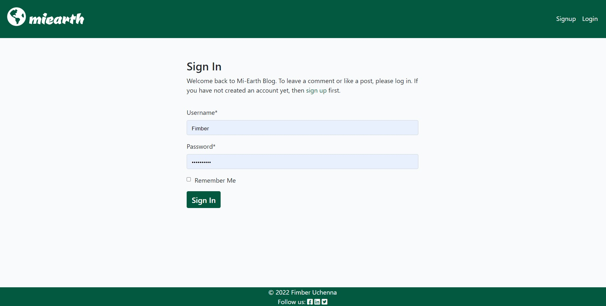

# Miearth
Miearth is a blog site dedicated to showcasing nature at it's finest and to promote calls to action on climate change. The site can be accessed by anyone. However, user's have to signup in order to make a post, comment on a post and like posts

## Table of Content

- [Responsiveness](#responsiveness)

- [Site Scope](#site-scope)
    * [user stories](#user-stories)

- [Features](#features)
    * [Navigation](#navigation)
    * [Features left to implement](#features-left-to-implement)

- [Database Model](#database-model)

- [Wire Frame](#wire-frame)

- [Language, Framework, Library and Tools](#language-framework-library-and-tools)

- [Testing](#testing)

- [Bugs](#bugs)

- [Deployment](#deployment)

- [Credits](#credits)

- [Acknowledgment](#acknowledgment)

- [Disclaimer](#disclaimer)


## Responsiveness:
The site is fully responsive across different browsers, and devices of different viewports.


## Site Scope
* Responsive Design: Miearth should be fully responsive across devices from screen size 280 upwards
* Functionality: The functionality are the same across both mobile and desktop devices.
* Features such as making a post, making a comment, and liking a post requires user to register for an account.
* UI CRUD functionality: Registered and logged in users’ ability to create a post, read posts, update their posts and delete their posts from the user interface without accessing the the admin panel.

### User stories
| As a...                | I can...                                                 | So that...                                                                 |
| :------------          |   :------------------------                              |        :--------------------------                                          |
| As a site user         | I can view a list of posts                               |  so that I can select one to read.                                          |
| As a site user         | I can click on a post                                    |  so that I can read the full post.                                          |
| As a Site User         | I can register an account                                |  so that I can comment, like or dislike a post.                             |
| As a Site User/Admin   | I can view comments on an individual post                |  so that I can read the conversation.                             |
| As a Site Admin        | I can create draft posts                                 |  so that I can finish writing the content later.                            |
| As a Site Admin/User   | I can create, read, update and delete posts              |  so that I can manage my post content.                                      |
| As a Site User / Admin | I can view the number of likes and dislikes on each post |  so that I can see which is the most popular or viral.                      |
| As a Site User  | I can view articles in pages |  so that the articles will appear in a digestible format
| As a Site User / Admin | I can have my comments and likes update in the background |  so that my page does not refresh at every comment/like.
| As a Site User / Admin | I can reset my login details |  so that I can regain access to my account when I forgot my login details
| As a Site User | I can login in with my social media account |  so that I can login with a single sign on

[back to content](#table-of-content)

## Features
### Navigation:
The navigation bar contains the site logo which is also a home button and two different views for logged in users and site visitors.
#### Navigation menu bar for site visitors/logged out users


For a logged in user, the registered username will appear as a link to the far right. On click the username drops down to a tab with links to view the logged in user profile, create a post or logout of the site.

#### Navigation menu bar for logged in users


#### Navigation menu bar for logged in users on click


#### Home page


#### Blog page


#### Blog page without post


#### Signup page


#### Sign in page


#### Sign out page


#### User profile page


#### User profile page without any post by the user


#### Add post page


#### Edit post page


#### Edit profile page


### Features left to implement:
* Follow Author functionality
* Single sign on with social media accounts
* Account password reset
* Background update of events (comments, likes)

 [back to content](#table-of-content)
## Database Model

Relational Database Model was used in this project


[back to content](#table-of-content)


## Wire Frame
Mock up site was created using Lucidchart wireframing. Individual frames can be seen [here](https://github.com/uchenna631/mi-earth/blob/main/media/images/miearth-wireframe.jpeg?raw=true)

[back to content](#table-of-content)
## Language, Framework, Library and Tools
* HTML5 [more on HTML5 ](https://en.wikipedia.org/wiki/HTML5)
* CSS3 [more on CSS](https://en.wikipedia.org/wiki/CSS)
* JavaScript [more on JavaScript](https://en.wikipedia.org/wiki/JavaScript)
* Python [Python doc](https://www.python.org/) [Read More on Python](https://en.wikipedia.org/wiki/Python_(programming_language))

* Bootstarp 4 [Bootstrap doc](https://getbootstrap.com/)
* Django [Django doc](https://www.djangoproject.com/)

* Django-allauth [Django allauth doc](https://django-allauth.readthedocs.io/en/latest/)
* Cloudinary for image hosting [read more on cloudinary ...](https://cloudinary.com/)
* Crispy-form [django-crispy-form read the doc](https://django-crispy-forms.readthedocs.io/en/latest/install.html)
* Summernote [Summernote Docs](https://summernote.org/)

* Lucidchart [more on Lucidchart](https://www.lucidchart.com/pages/)
* Heroku [more on Heroku](https://devcenter.heroku.com/)

[back to content](#table-of-content)

## Testing
The codes were tested by doing the following:
### Manual Testing:
1.	Entered invalid inputs and wrong inputs where inputs are requested with respect to integers and strings.
2.	Recruited help from friends to use app and offer feedback
3.  Lunching site on different devices and browsers to check for responsiveness and bugs.
    * google chrom
    * fire fox
    * microsoft edge
    * Operamini

#### W3C Validation: No Errors returned


#### Pep8 Validation: No errors returned


#### Accessibility:

Accessibility testing was conducted using light house devtools and it confirmed that the fonts and colors selected are easy to read and accecssible.


## Bugs
* none found

[back to content](#table-of-content)

## Deployment
The project was deployed to Heroku with the following steps:
1. create a Heroku account
1.  in the settings section reveal the config var and enter the key and value pair from the settings.py file
DJANGO_URL, SECRET_KEY, PORT and CLOUDINARY_URL
1.	on the Resources tab select Heroku Postgres as the database
1. on the treminal type:
 ```
 python3 manage.py makemigrations
 ```
 and
 ```
 python3 manage.py migrate
 ```
 to migrate your database.
1.	on the CLI create a requirements.txt file using the command:
 ```
 pip3 freeze -–local > requirements.txt
 ```
1.	Add a Procfile with the required codes in it: ```web: gunicorn storybase.wasgi```
1.	Change Debug to False and commit repository to Github.
1. In the deploy section select github and search for the repository name. link up the Heroku app to the github repository code.
1. Scroll down and setup automatic deploy to allow Heroku to update app from gitpod push and click on the manual deploy option.
1. click view to view the app.
* The Deployed App can be viewed here [miearth](https://miplanetearth.herokuapp.com/)

[back to content](#table-of-content)

## Credits
* Code Institute [link to site](https://codeinstitute.net/ie/)
* Django Doc [read the doc](https://docs.djangoproject.com/en/4.0/)
* Pixabay for the images used on the site [Pixabay](https://pixabay.com/)
* Lucidchart fore wireframes [Link to lucid dashboard](https://lucid.app/documents#/dashboard)
* Ukachukwu Samuel for support on forms
* Wikipedia for post contents
* Google fonts for logo
* Adobe colors for color pallete

[back to content](#table-of-content)

## Acknowledgment
* Code Institute Tutor Assistance
* Spencer Bariball
* Samuel Ukachukwu
* Uzoamaka Eze, my wife, for her care and love

[back to content](#table-of-content)

## Disclaimer
This site was developed for educational purposes only. _Fimber Uchenna 05/10/2022_
